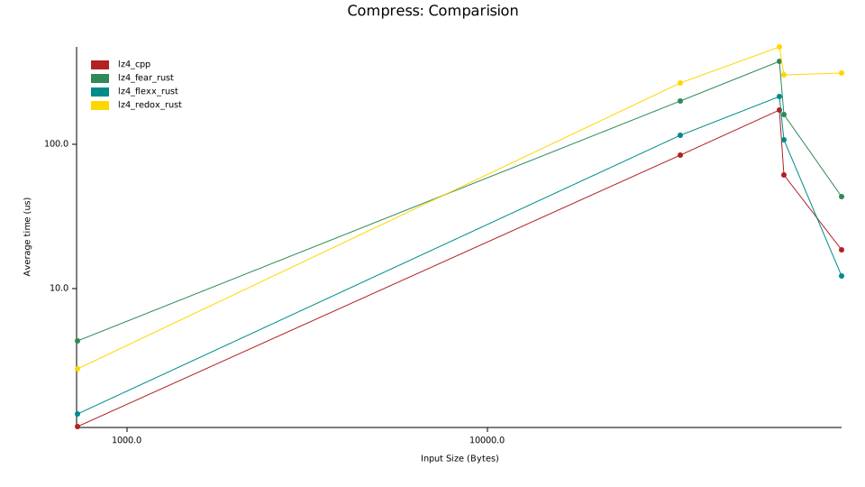
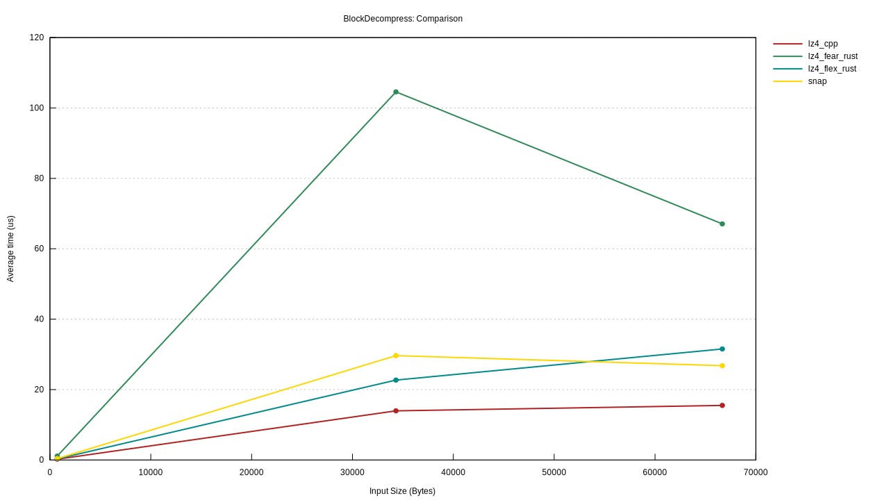

[](https://docs.rs/crate/lz4_flex/)
[](https://crates.io/crates/lz4_flex)

# lz4_flex


Fastest LZ4 implementation in Rust. Originally based on [redox-os' lz4 compression](https://crates.io/crates/lz4-compress), but now a complete rewrite.
The results in the table are from a benchmark in this project (66Kb JSON) with the block format. 

AMD Ryzen 7 5800H, rustc 1.57.0-nightly (5ecc8ad84 2021-09-19), Linux Mint.

|    Compressor        | Compression | Decompression | Ratio		 |
|----------------------|-------------|---------------|---------------|
| lz4_flex unsafe      | 1897 MiB/s   | 7123 MiB/s    | 0.2289   	 |
| lz4_flex unsafe w. checked_decode      | 1897 MiB/s   | 6637 MiB/s    | 0.2289   	 |
| lz4_flex safe        | 1591 MiB/s   | 5163 MiB/s    | 0.2289   	 |
| lzzz (lz4 1.9.3)     | 2235 MiB/s   | 7001 MiB/s    | 0.2283   	 |
| lz4_fear             | 886 MiB/s   | 1359 MiB/s     | 0.2283	     |
| snap                 | 1886 MiB/s   | 1649 MiB/s     | 0.2242      |


## Features
- Very good logo
- LZ4 Block format
- LZ4 Frame format (thanks @arthurprs)
- High performance
- 1,5s clean release build time
- Feature flags to configure safe/unsafe code usage
- no-std support with block format (thanks @coolreader18)
- 32-bit support

## Usage: 
Compression and decompression uses no usafe via the default feature flags "safe-encode" and "safe-decode". If you need more performance you can disable them (e.g. with no-default-features).

Safe:
```
lz4_flex = { version = "0.9.3" }
```

Performance:
```
lz4_flex = { version = "0.9.3", default-features = false }
```

Warning: If you don't trust your input and your are using the Block format, use checked-decode in order to avoid out of bounds access. When using the Frame format make sure to enable checksums.
```
lz4_flex = { version = "0.9.3", default-features = false, features = ["checked-decode"] }
```

```rust
use lz4_flex::{compress_prepend_size, decompress_size_prepended};

fn main(){
    let input: &[u8] = b"Hello people, what's up?";
    let compressed = compress_prepend_size(input);
    let uncompressed = decompress_size_prepended(&compressed).unwrap();
    assert_eq!(input, uncompressed);
}
```


## no_std support

no_std support is currently only for the block format, since the frame format uses `std::io::Write`, which is not available in core.


## Benchmarks
The benchmark is run with criterion, the test files are in the benches folder.

Currently 4 implementations are compared, this one, [lz-fear](https://github.com/main--/rust-lz-fear) and the [c++ version via rust bindings](https://crates.io/crates/lz4) and [snappy](https://github.com/burntsushi/rust-snappy). 
The lz4-flex version is tested with the feature flags safe-decode and safe-encode switched on and off.

- lz4_cpp: https://crates.io/crates/lz4
- lz-fear: https://github.com/main--/rust-lz-fear
- snap: https://github.com/burntsushi/rust-snappy 

### Results v0.8.0 17-05-2021 (safe-decode and safe-encode off)
`cargo bench --no-default-features`

Executed on Core i7-6700 Linux Mint.




### Results v0.8.0 17-05-2021 (safe-decode and safe-encode on)
`cargo bench`

Executed on Core i7-6700 Linux Mint.




## Miri

[Miri](https://github.com/rust-lang/miri) can be used to find issues related to incorrect unsafe usage:

`MIRIFLAGS="-Zmiri-disable-isolation -Zmiri-disable-stacked-borrows" cargo +nightly miri test --no-default-features --features frame`

## Fuzzer
This fuzz target generates corrupted data for the decompressor. Make sure to switch to the checked_decode version in `fuzz/Cargo.toml` before testing this.
`cargo +nightly fuzz run fuzz_decomp_corrupt_block` and `cargo +nightly fuzz run fuzz_decomp_corrupt_frame`

This fuzz target asserts that a compression and decompression rountrip returns the original input.
`cargo +nightly fuzz run fuzz_roundtrip` and `cargo +nightly fuzz run fuzz_roundtrip_frame`

This fuzz target asserts compression with cpp and decompression with lz4_flex returns the original input.
`cargo +nightly fuzz run fuzz_roundtrip_cpp_compress`

## Bindings in other languages
 - Node.js: [lz4-napi](https://github.com/antoniomuso/lz4-napi) 
 - Wasm: [lz4-wasm](https://github.com/PSeitz/lz4_flex/tree/main/lz4-wasm)

## TODO
- High compression

