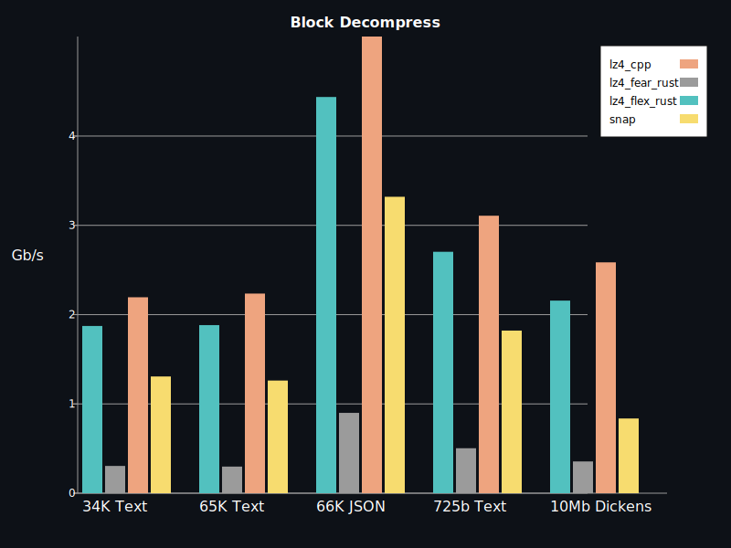

[](https://docs.rs/crate/lz4_flex/)
[](https://crates.io/crates/lz4_flex)

# lz4_flex


Fastest LZ4 implementation in Rust. Originally based on [redox-os' lz4 compression](https://crates.io/crates/lz4-compress), but now a complete rewrite.
The results in the table are from a benchmark in this project (66Kb JSON, 10MB dickens) with the block format. 

AMD Ryzen 7 5900HX, rustc 1.69.0 (84c898d65 2023-04-16), Manjaro, CPU Boost Disabled, CPU Governor: Performance

66Kb JSON
|    Compressor        | Compression | Decompression | Ratio		 |
|----------------------|-------------|---------------|---------------|
| lz4_flex unsafe w. unchecked_decode  | 1615 MiB/s   | 5973 MiB/s    | 0.2284   	 |
| lz4_flex unsafe | 1615 MiB/s   | 5512 MiB/s    | 0.2284   	 |
| lz4_flex safe        | 1272 MiB/s   | 4540 MiB/s    | 0.2284   	 |
| lzzz (lz4 1.9.3)     | 1469 MiB/s   | 5313 MiB/s    | 0.2283   	 |
| lz4_fear             | 662 MiB/s   | 939 MiB/s     | 0.2283	     |
| snap                 | 1452 MiB/s   | 1649 MiB/s     | 0.2242      |

10 Mb dickens
|    Compressor        | Compression | Decompression | Ratio		 |
|----------------------|-------------|---------------|---------------|
| lz4_flex unsafe w. unchecked_decode       | 347 MiB/s   | 3168 MiB/s    |  0.6372  	 |
| lz4_flex unsafe      | 347 MiB/s   | 2734 MiB/s    |  0.6372  	 |
| lz4_flex safe        | 259 MiB/s   | 2338 MiB/s    | 0.6372 |
| lzzz (lz4 1.9.3)     | 324 MiB/s | 2759 MiB/s    | 0.6372 |
| lz4_fear             | 201 MiB/s   | 370 MiB/s     | 0.6372 |
| snap                 | 286 MiB/s   | 679 MiB/s     | 0.6276 |

## Features
- Very good logo
- LZ4 Block format
- LZ4 Frame format (thanks @arthurprs)
- High performance
- 1,5s clean release build time
- Feature flags to configure safe/unsafe code usage
- no-std support with block format (thanks @coolreader18)
- 32-bit support

## Usage: 
Compression and decompression uses no usafe via the default feature flags "safe-encode" and "safe-decode". If you need more performance you can disable them (e.g. with no-default-features).

Safe:
```
lz4_flex = { version = "0.11" }
```

Performance:
```
lz4_flex = { version = "0.11", default-features = false }
```

### Block Format
The block format is only valid for smaller data chunks as as block is de/compressed in memory.
For larger data use the frame format, which consists of multiple blocks.

```rust
use lz4_flex::block::{compress_prepend_size, decompress_size_prepended};

fn main(){
    let input: &[u8] = b"Hello people, what's up?";
    let compressed = compress_prepend_size(input);
    let uncompressed = decompress_size_prepended(&compressed).unwrap();
    assert_eq!(input, uncompressed);
}
```


## no_std support

no_std support is currently only for the block format, since the frame format uses `std::io::Write`, which is not available in core.

## Benchmarks
The benchmark is run with criterion, the test files are in the benches folder.

Currently 4 implementations are compared, this one, [lz-fear](https://github.com/main--/rust-lz-fear), the [c version via rust bindings](https://crates.io/crates/lzzzz) and [snappy](https://github.com/burntsushi/rust-snappy). 
The lz4-flex version is tested with the feature flags safe-decode and safe-encode switched on and off.

- lz4_cpp: https://crates.io/crates/lzzzz
- lz-fear: https://github.com/main--/rust-lz-fear
- snap: https://github.com/burntsushi/rust-snappy 

Tested on AMD Ryzen 7 5900HX, rustc 1.69.0 (84c898d65 2023-04-16), Manjaro, CPU Boost Disabled, CPU 3GHZ

### Results v0.11.0 02-06-2023 (safe-decode and safe-encode off)
`cargo bench --no-default-features`


### Results v0.11.0 02-06-2023 (safe-decode and safe-encode on)
`cargo bench`




## Miri

[Miri](https://github.com/rust-lang/miri) can be used to find issues related to incorrect unsafe usage:

`MIRIFLAGS="-Zmiri-disable-isolation -Zmiri-disable-stacked-borrows" cargo +nightly miri test --no-default-features --features frame`

## Fuzzer
This fuzz target generates corrupted data for the decompressor. 
`cargo +nightly fuzz run fuzz_decomp_corrupt_block` and `cargo +nightly fuzz run fuzz_decomp_corrupt_frame`

This fuzz target asserts that a compression and decompression rountrip returns the original input.
`cargo +nightly fuzz run fuzz_roundtrip` and `cargo +nightly fuzz run fuzz_roundtrip_frame`

This fuzz target asserts compression with cpp and decompression with lz4_flex returns the original input.
`cargo +nightly fuzz run fuzz_roundtrip_cpp_compress`

## Bindings in other languages
 - Node.js: [lz4-napi](https://github.com/antoniomuso/lz4-napi) 
 - Wasm: [lz4-wasm](https://github.com/PSeitz/lz4-wasm)

## TODO
- High compression

## Migrate from v0.10 to v0.11.1
To migrate, just remove the `checked-decode` feature flag if you used it.


