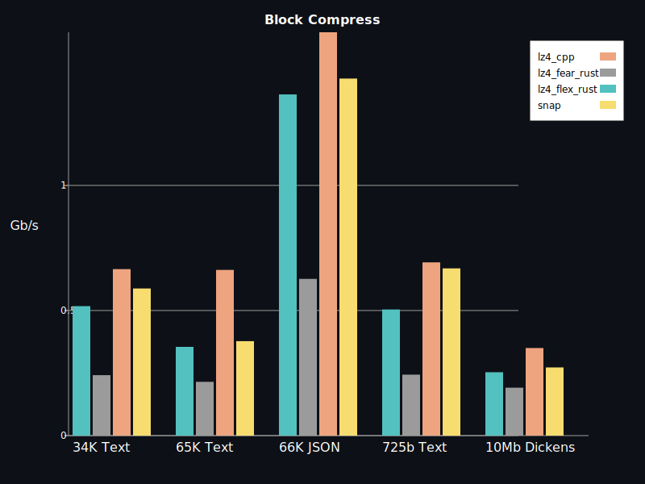

[](https://docs.rs/crate/lz4_flex/)
[](https://crates.io/crates/lz4_flex)

# lz4_flex


Fastest LZ4 implementation in Rust. Originally based on [redox-os' lz4 compression](https://crates.io/crates/lz4-compress), but now a complete rewrite.
The results in the table are from a benchmark in this project (66Kb JSON).

|    Compressor    | Compression | Decompression |
|------------------|-------------|---------------|
| lz4_flex unsafe  | 711 MiB/s   | 3733 MiB/s    |
| lz4_flex safe    | 628 MiB/s   | 1433 MiB/s    |
| lz4_cpp          | 914 MiB/s   | 3793 MiB/s    |
| lz4_fear         | 443 MiB/s   | 836 MiB/s     |

## Features
- Very good logo
- LZ4 Block format
- High performance
- 0,5s clean release build time
- Feature flags to configure safe/unsafe code usage
- no-std support (thanks @coolreader18)

## Usage: 
Compression and decompression uses no usafe via the default feature flags "safe-encode" and "safe-decode". If you need more performance you can disable them (e.g. with no-default-features).

Safe:
```
lz4_flex = { version = "0.6.1" }
```

Performance:
```
lz4_flex = { version = "0.6.1", default-features = false }
```

```rust
use lz4_flex::{compress_prepend_size, decompress_size_prepended};

fn main(){
    let input: &[u8] = b"Hello people, what's up?";
    let compressed = compress_prepend_size(input);
    let uncompressed = decompress_size_prepended(&compressed).unwrap();
    assert_eq!(input, uncompressed);
}
```

## Benchmarks
The benchmark is run with criterion, the test files are in the benches folder.

Currently 3 implementations are compared, this one, the [redox-version](https://crates.io/crates/lz4-compress), [lz-fear](https://github.com/main--/rust-lz-fear) and the [c++ version via rust bindings](https://crates.io/crates/lz4). 
The lz4-flex version is tested with the feature flags safe-decode and safe-encode switched on and off.

- lz4_redox_rust: https://crates.io/crates/lz4-compress
- lz4_cpp: https://crates.io/crates/lz4
- lz-fear: https://github.com/main--/rust-lz-fear

### Results v0.4.1 10-12-2020 (safe-decode and safe-encode off)
`cargo bench --no-default-features`

Executed on Core i7-6700 Win10 WSL.


### Results v0.4 04-12-2020 (safe-decode and safe-encode on)
`cargo bench`

Executed on Core i7-6700 Win10 WSL.




## Miri

[Miri](https://github.com/rust-lang/miri) can be used to find issues related to incorrect unsafe usage:

`MIRIFLAGS="-Zmiri-disable-isolation -Zmiri-disable-stacked-borrows" cargo miri test --no-default-features`

## Fuzzer
This fuzz target fuzzes, and asserts compression and decompression returns the original input.
`cargo fuzz run fuzz_roundtrip`

This fuzz target fuzzes, and asserts compression with cpp and decompression returns the original input.
`cargo fuzz run fuzz_roundtrip_cpp_compress`

## TODO
- Frame format
- High compression
- Dictionary Compression

